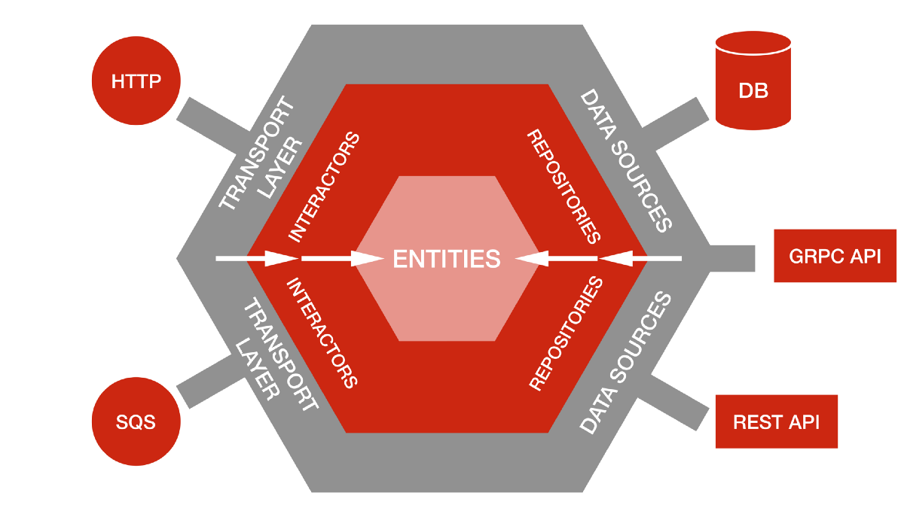

# URL Shortener

This microservice creates a code for a given url. It was created following a hexagonal architecture and it was made for learning purposes.

## Hexagonal Architecture

Hexagonal architecture is a model or pattern for designing software applications. The idea behind it is to put inputs and outputs at the edges of your design. In doing so, you isolate the central logic (the core) of your application from outside concerns. Having inputs and outputs at the edge means you can swap out their handlers without changing the core code.

## Helpful resources:
* https://en.wikipedia.org/wiki/Hexagonal_architecture_(software)
* https://medium.com/sciforce/another-story-about-microservices-hexagonal-architecture-23db93fa52a2
* https://dzone.com/articles/hexagonal-architecture-what-is-it-and-how-does-it
* https://medium.com/@matiasvarela/hexagonal-architecture-in-go-cfd4e436faa3
* https://www.youtube.com/watch?v=YS4e4q9oBaU
